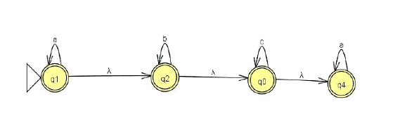

# non-deterministic-finite-automata
 Convert a NFA (Non-deterministic Finite Automaton) to a DFA (Deterministic Finite Automata) 

### Partial results until now: 10/09/2024 - 04:19am

Currently being capable of getting λ-closure states recursively, and generating the DFA super states. Using the following NFA:



WHAT MY CODE GENERATES:
```json
{
  "Q0Q1Q2Q4": [
    "Q1",
    "Q2",
    "Q0",
    "Q4"
  ],
  "Q0Q2Q4": [
    "Q2",
    "Q0",
    "Q4"
  ],
  "Q0Q4": [
    "Q0",
    "Q4"
  ],
  "Q4": [
    "Q4"
  ]
}
 ```

 WHAT SHOULD GENERATE:

 ```json
{
  "Q0Q1Q2Q4": [
    "Q0Q1Q2Q4",
    "Q0Q2Q4",
    "Q0Q4"
  ],
  "Q0Q2Q4": [
    "Q4",
    "Q0Q2Q4",
    "Q0Q4"
  ],
  "Q0Q4": [
    "Q4",
    "Ø",
    "Q0Q4"
  ],
  "Q4": [
    "Q4",
    "Ø",
    "Ø"
  ]
}
 ```

Is still very raw, but im going to improve on performance and optimizations later, my major priority now is to get the code working.

> Some references that helped me:
> * https://web.stanford.edu/class/archive/cs/cs103/cs103.1202/notes/Guide%20to%20the%20Subset%20Construction.pdf
>
>* https://github.com/Rahul-Jyoti/NFA-TO-DFA-CONVERSION/tree/master
>
>* ChatGPT ;)
